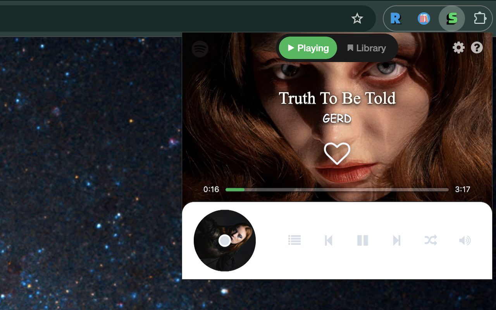
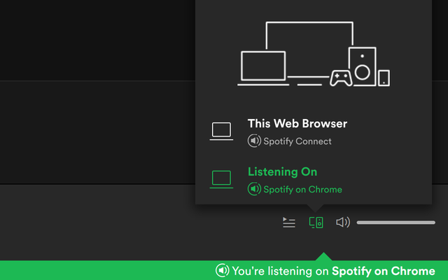

# Install

- [chrome web store](https://chrome.google.com/webstore/detail/kgniaoeehojejhienanbmikafmogfdfh)

# Spotify on Chrome

Spotify has a really cool feature called **Spotify Connect**. Basically it could turn anything into a Spotify player, and control it with your cellphone. I made this app trying to connect Spotify with Chrome. So why use this player instead of Spotify website?

   1. Play in background of Chrome, no need to keep Spotify's tab open;
   2. Global keyboard shortcut to play/stop/next/previous;
   3. Seamlessly play your steam on Chrome, with the controls of your cellphone.

After install it from the web store, use it in the following steps:

1. **Authorize** on Spotify;
2. Choose music on Spotify and play it on **"Spotify on Chrome"**.

# Build

1. use `yarn` or `npm install` to install requirements.
2. `npm start` to start a webpack dev-server, add the `build/` directory in your browser's extension page to load the extension.
3. `npm run build` to build the release code. The dest path is `build/`.

# Privacy Policy

This app uses Spotify's API, so it needs you to authorize on Spotify. It doesn't collect any information about your Spotify account or any other websites. It doesn't sell any your data either.
Besides, it's open-source.

# Donate 
If you find it's useful, please consider to donate, a cup of coffee would be my greatest incentive.  
Thank you.

